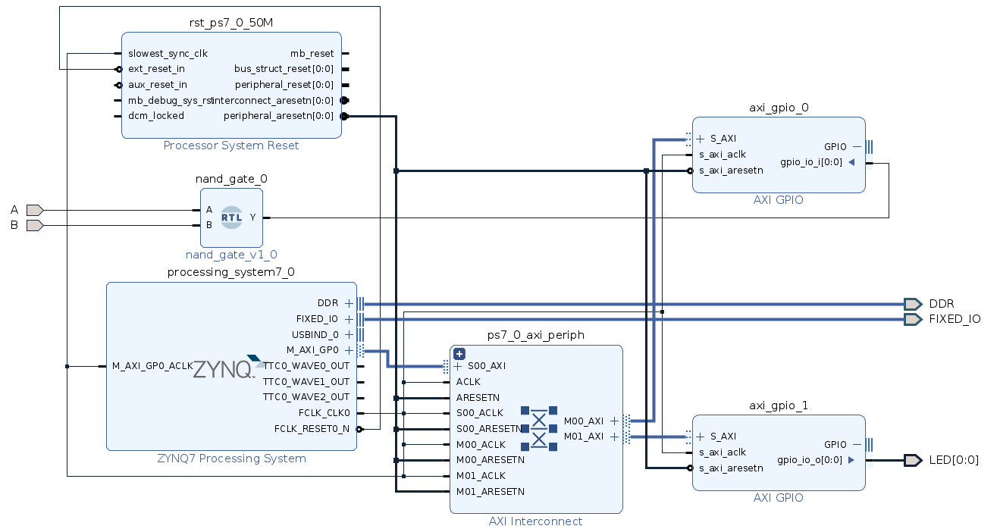

## Nand Gate using **AND gate on PL** (FPGA) and **NOT gate on PS** (ARM A9)

- Source the settings.sh and other bit files if already not done.
- Open Vivado using `vivado &` and generate a bit file
- **FPGA Block Diagram:** of this example:

- Bit file will be stored in `<runs-folder>/<implementation-folder>/design-wrapper-1.bit`

- Export Hardware including bitstream file for Vitis IDE
- This will generate a `XSA` file in project directory
- Open the vitis IDE and build the project.
- Flash the project and check output on the board.
- SW12 is the Input to the NAND gate
- LED0 is the Output of the NAND gate

### Reference:

- [ZYNQ for beginners: programming and connecting the PS and PL | Part 1](https://youtu.be/_odNhKOZjEo)
- [For Complete Steps follow this xilinx ZC702 Tutorial](https://xilinx.github.io/Embedded-Design-Tutorials/docs/2021.1/build/html/docs/Introduction/Zynq7000-EDT/2-using-zynq.html)

