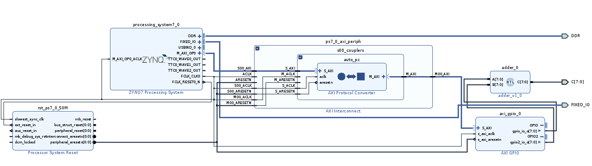
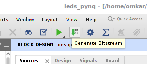
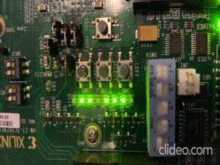

## PYNQ Custom Overlay of Adder

### FPGA Block diagram of this Adder:

### Use this Example directly without building:

- Copy the `LED_driver` folder on to the board in `/home/xilinx/jupyter_notebooks/`
- It's a reconfigurable system, we don't need to build image again.
- Run the python notebook and check the output on the LEDs.

### Build the FPGA Bit stream using Vivado:

- Open vivado using `vivado &` and open project `leds_pynq.xpr`
- Build the bitstream:

- Copy Bitstream (`.bit`), TCL (`.tcl`), hwh file (`.hwh`) to the board and import the bit file in pynq.

### Demo Output:

