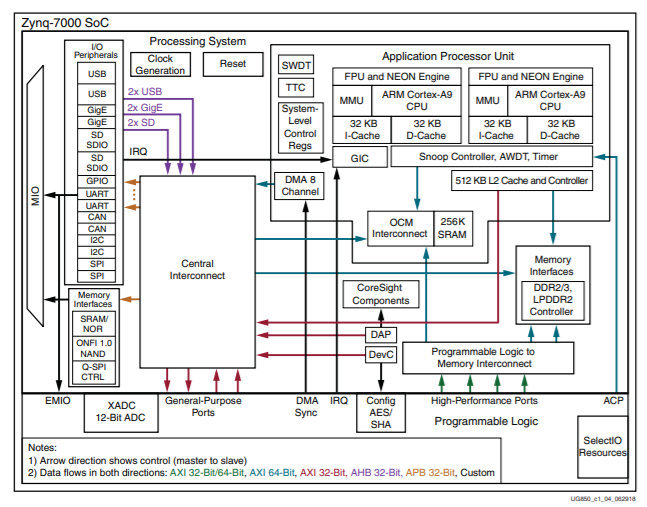
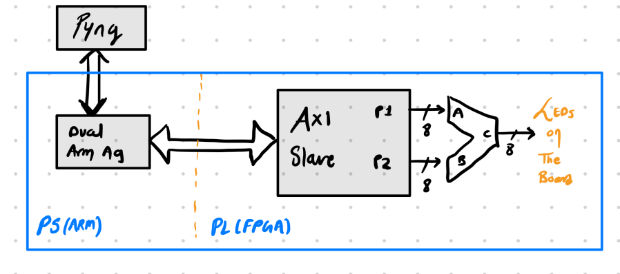

# Zynq-7000 ZC702 Examples

- These Examples are for [ZC702 Board](https://www.xilinx.com/products/silicon-devices/soc/zynq-7000.html)
- For porting any of these examples to other board you will need to rebuild these examples with appropriate xdc files.
- For ZC702 Pin Map follow Datasheet and master xdc file:
- ZC702 DATASHEET: [here](https://www.xilinx.com/support/documentation/boards_and_kits/zc702_zvik/ug850-zc702-eval-bd.pdf)
- ZC702 Master XDC file: [here](https://www.xilinx.com/member/forms/download/design-license.html?cid=203198&filename=zc702-ucf-xdc-rdf0173-rev3-0.zip)

## ZYNQ-7000 Architecture:

## Examples:

1. Nand Gate using **AND gate on PL** (FPGA) and **NOT gate on PS** (ARM A9) : [here](https://github.com/DeepYNet/zc702-examples/tree/main/Examples/NAND_PS_PL)

2. PYNQ Custom Overlay of Adder: [Here]()

